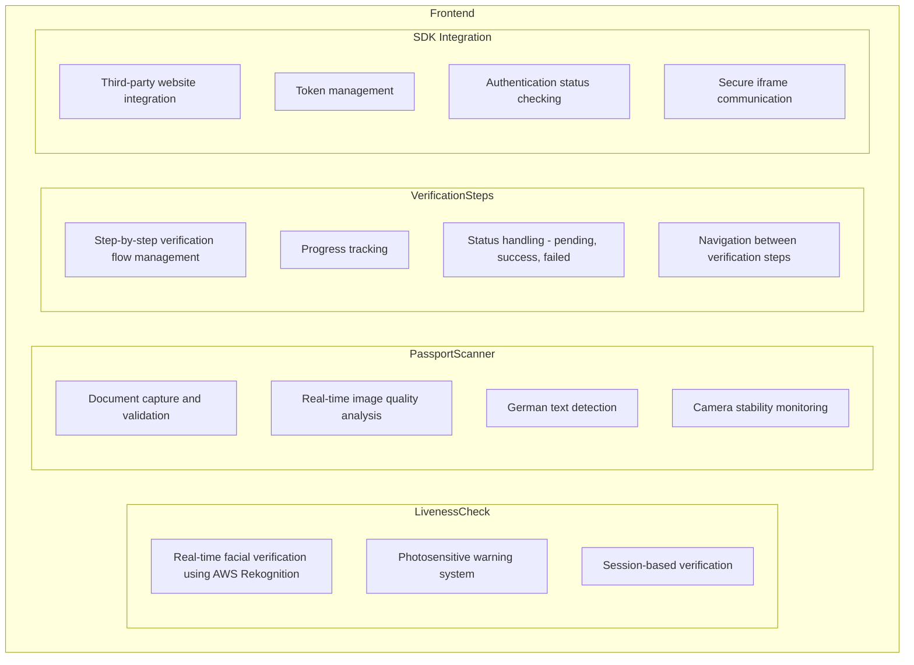
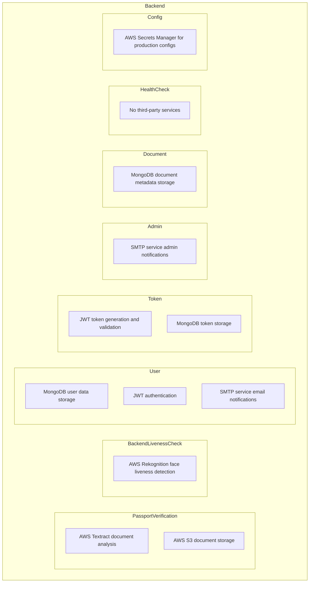

# Introduction

Trusted Age is a system designed to help developers verify the age and authenticity of users accessing their applications or content.
By integrating with Trusted Age, developers can ensure that their users are real people and meet certain age requirements (e.g., over 18 years old), enhancing compliance and trustworthiness.

## Who Is It For?

This integration is intended for:

- **Developers and Organizations** who need to verify the age and authenticity of their users.
- **Platforms with Age-Restricted Content** such as forums, marketplaces, social networks, or any service requiring user verification.
- **Applications Seeking Compliance** with legal regulations regarding age verification and user authenticity.

By using this integration, developers can offload the complex process of user verification to Trusted Accounts, ensuring a seamless and secure experience.

## How Does It Work?

### System Overview

The integration involves several key components working together:

1. **User Authentication**: Users log in and verify their identity with Trusted Accounts.
2. **Verification Process**: The user chooses their country of residence and document type.
    1. The user chooses their country of residence and document type.
    2. The user can either upload the document or use the camera scanner for a more convenient image analysis on their device. This analysis will perform checks to determine if the image is blurry, if there is text present, and if the camera is stable. Once a valid document is detected, it is then uploaded to the server.
    3. The system processes the uploaded document using AWS Textract, which handles the analysis differently based on the document type. For passports, AWS Textract's form labeller is used to extract structured information, while for driving licenses, we extract raw text and then parse the required information ourselves.
    4. The user completes a liveness check using AWS' liveness detection feature to verify that the document belongs to them. This liveness check involves face matching and motion verification to ensure that the person presenting the document is real and alive, thereby reducing the risk of spoofing or fraudulent attempts.
    5. At this stage, the user is taken to a verification pending screen, and we then have an approval process on a separate admin application. Once the user is approved, they receive an email notification confirming their verification status. The admin will see all data gathered for that user as well as pictures from their liveness check and documents, and compare the two. Additionally, the admin receives an email for each verification request to keep track of pending approvals. Once the user is approved, they receive an email notification confirming their verification status.
    6. Once the user is approved, they can then log in and receive a token saved in their browser at any time (the same token later used by the SDK), allowing them to authenticate with other sites. More on this part of the flow below.
3. **Token Generation**: Upon successful verification, Trusted Accounts issues a JWT (JSON Web Token) signed with its private key.
4. **Client-Side SDK**: Developers include the Trusted Accounts SDK that can pull the saved JWT from local storage on the user's device. Using local storage ensures that the token remains accessible for subsequent authentication requests, but it is important to handle this storage securely to protect against potential vulnerabilities. The idea behind this part of the flow is to improve performance and user experience by ensuring clients do not need to contact Trusted Accounts for every authentication attempt.
5. **Server-Side Verification**: The developer's server verifies the JWT using Trusted Accounts' JWKS (JSON Web Key Set) endpoint. This validates that the token was signed by the TrustedAccounts server.
6. **Access Control**: Based on the token's validity and claims, the server grants or denies access to protected resources.

### System Architecture



### Integration Components

1. **Client-Side SDK**

    - **Purpose**: Facilitates communication between the client application and Trusted Accounts to retrieve the JWT securely.
    - **Mechanism**: Uses an iframe and window messaging to interact with Trusted Accounts without exposing tokens directly to anyone not using the SDK. This would later allow us to add domain whitelisting so that only trusted domains can access the token.

2. **Server-Side Verification**

    - **Objective**: Ensures the JWT received from the client is valid and issued by Trusted Accounts.
    - **Process**: Fetch the JWKS from Trusted Accounts, use the public key to verify the JWT's signature, and decode the token to access user claims.

## Integration Guide

### Client-Side Integration

1. **Including the SDK**

   Add the Trusted Accounts SDK to your HTML page:

   ```
   <script src="http://age.trustedaccounts.org/sdk.js"></script>
   ```

2. **Authenticating Users**

   Implement a button or trigger for users to initiate verification:

   ```
   <button id="verifyButton">Verify Me</button>
   ```

   Add the JavaScript logic to handle the verification process:

   ```
   window.TrustedAgeSdk.isAuthenticated(function(authenticated) {
     if (authenticated) {
       window.TrustedAgeSdk.getToken(function(token) {
         // Send the token to the server
         fetch('/verify-token', {
           method: 'POST',
           headers: {
             'Content-Type': 'application/json',
           },
           body: JSON.stringify({ token }),
         })
         .then((response) => {
           response.text().then(html => {
             document.open();
             document.write(html);
             document.close();
           });
         })
         .catch((error) => {
           console.error('Error verifying token:', error);
           showError('Access Denied: Verification failed.');
         });
       });
     } else {
       showError(
         "You're not logged in. " +
         "<a href='https://stage-age.trustedaccounts.org/' target='_blank' style='color: #4CAF50;'>Click here to log in</a>."
       );
     }
   });
   ```

3. **Sending the Token to Your Server**

   Create a function to send the JWT to your server, typically via a POST request:

   ```
   function sendTokenToServer(token) {
     fetch('/verify-token', {
       method: 'POST',
       headers: {
         'Content-Type': 'application/json',
       },
       body: JSON.stringify({ token }),
     })
       .then(response => {
         if (response.ok) {
           // Access granted
           window.location.href = '/access-granted.html';
         } else {
           // Access denied
           window.location.href = '/access-denied.html';
         }
       })
       .catch(error => {
         console.error('Error verifying token:', error);
         // Handle error
       });
   }
   ```

### Server-Side Integration

1. **Fetching the JWKS**

   Use a library like `jwks-rsa` (for Node.js) to fetch and manage the JWKS:

   ```
   const jwksClient = require('jwks-rsa');

   const client = jwksClient({
     jwksUri: 'http://age.trustedaccounts.org/.well-known/jwks.json',
   });
   ```

2. **Verifying the Token**

   Implement an endpoint to receive the token and verify it:

   ```
   app.post('/verify-token', (req, res) => {
     const token = req.body.token;

     if (!token) {
       return res.redirect('/access-denied.html');
     }

     jwt.verify(token, getKey, { algorithms: ['RS256'] }, (err, decoded) => {
       if (err || !decoded.isOver18) {
         return res.redirect('/access-denied.html');
       }

       // Token is valid, grant access
       res.redirect('/access-granted.html');
     });
   });

   function getKey(header, callback) {
     client.getSigningKey(header.kid, function(err, key) {
       if (err) {
         return callback(err);
       }
       const signingKey = key.getPublicKey();
       callback(null, signingKey);
     });
   }
   ```

## Security Considerations

- **Token Security**: Tokens should be handled securely. Do not store tokens in insecure storage or expose them in URLs.
- **HTTPS**: Always use HTTPS in production to protect data in transit.
- **CORS**: Configure Cross-Origin Resource Sharing appropriately if your client and server are on different domains.
- **Key Management**: Regularly rotate your keys and protect your private keys from unauthorized access.
- **Error Handling**: Do not expose sensitive error details to end-users.

## Future Work

- **Domain Whitelisting**: Allow developers to whitelist domains that can access the token.
- **Document Analysis**: Enhance document analysis to support more document types and improve accuracy. Currently without data, there are sometimes issues grabbing the date and document number from certain document types.
- **Automatic Approval**: Implement automatic approval for verified users based on predefined criteria and image analysis - as the job of the Admin is currently only comparing the two images.

## Document Analysis Workarounds

Until we gather more data, it will still be possible to use string pattern matching to attempt to extract the 
required information from the document. This is a temporary solution until we have enough data to train a model
to extract the information more accurately.

Another alternative is that with AWS you also have the option to use the form labeller and can add custom labels
to the form labeller to extract the information you need. This is a more manual process but can be more accurate
than the raw text extraction.

### Current known issues:
- With German passports / IDs, there is a bit of a space between the month/day and the year. This space is confusing the
  current date extraction algorithm. This can be fixed by adding a custom label to the form labeller to extract the
  date in the correct format - or additional pattern matching.
- We don't know what we don't know - we need more images of passports, IDs and driving licenses to evaluate the accuracy
  of the current approach and improve it.

## Keys

Generate a new keypair for signing JWTs and securely store the private key.
You can run the script in keys/geenerate-keys.sh to generate a new keypair encoded
in base64. Make sure to pass these in via CI.

# Setting up Development Environment

```bash
$ cd frontend
$ pnpm install
$ pnpm start

$ cd backend
$ pnpm install
$ pnpm start

$ cd demo
$ pnpm install
$ pnpm start

```

## FAQs

**Q1: How do I get the SDK?**

A1: Include it directly from Trusted Accounts:

```
<script src="http://age.trustedaccounts.org/sdk.js"></script>
```

**Q2: What if the user is not over 18?**

A2: The token's `isOver18` claim will be false, and your server should deny access accordingly.

**Q3: Can I customize the verification process?**

A3: The verification process is standardized to ensure security and consistency. However, you can customize how you handle the token and user experience on your platform.